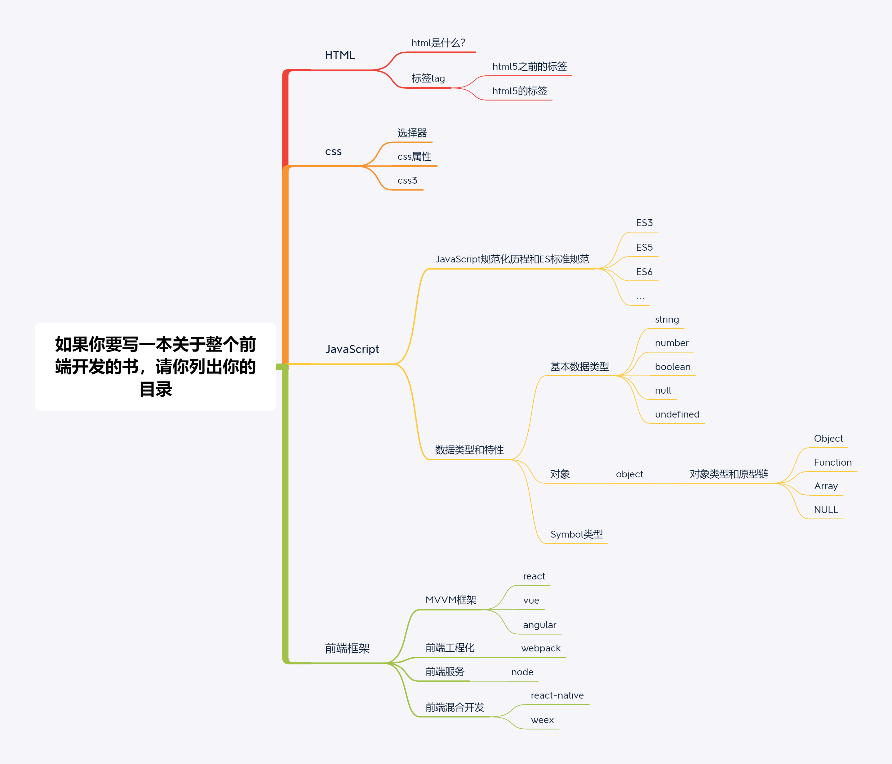

# 作业1
对比自己写的目录，再对比老师提供的目录。主要差距在于：
- 基础不扎实，并不能用通用行业术语陈述html+css+js的各种知识点，而且知识脉络并不清晰，并不确认
- 没有对核心知识点进行溯源，理解的并不深刻
- 知识点更多地偏向于平时的框架或用到的方面，有很多缺漏，如API等
- 很多英文专业术语并不了解

# 作业2

# 本周学习总结
处理了解追溯法是如何进行的，并有了一定量的实践，知识网络还存在需要补充和追溯的地方，将会边开展课程边进行迭代。

有一点感悟：**踏出第一步后，回头看并没有之前想象中困难。**